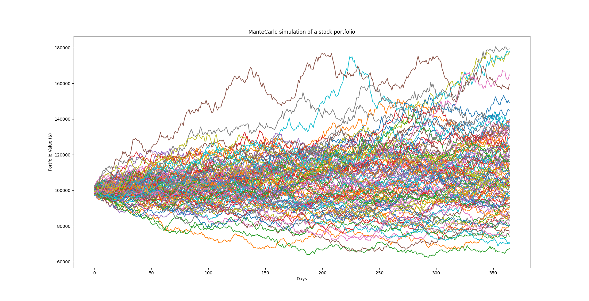

# 📈 Monte Carlo Simulation of a Stock Portfolio

This project simulates the future performance of a diversified stock portfolio over a 1-year horizon using a **Monte Carlo method with Cholesky decomposition** for correlated asset returns. The simulation is built with Python and financial data retrieved using the `yfinance` API.

---

## 💡 Project Summary

- **Goal:** Forecast the potential value range of a $100,000 portfolio made up of 5 Australian stocks.
- **Method:** Monte Carlo simulation using **Cholesky decomposition** of the covariance matrix to introduce realistic inter-stock correlations.
- **Output:** A visual representation of 100 simulated paths for the portfolio over 365 days.

---

## 🧠 What The Project Shows

- How to fetch historical stock data using `yfinance`
- How to compute daily returns, mean returns, and a covariance matrix
- Why Cholesky decomposition is used to introduce correlation in simulations
- How Monte Carlo methods can be applied in financial forecasting
- How to visualize risk and uncertainty in portfolio performance

---

## 📊 Stocks Included

The portfolio simulates the following Australian stocks (ASX-listed):

- Commonwealth Bank of Australia (`CBA.AX`)
- BHP Group Limited (`BHP.AX`)
- National Australia Bank (`NAB.AX`)
- Westpac Banking Corporation (`WBC.AX`)
- Santos Limited (`STO.AX`)

---

## 🚀 How It Works

1. **Data Retrieval:** Historical closing prices for the last 300 days.
2. **Preprocessing:** Calculate daily percent changes, mean returns, and the covariance matrix.
3. **Portfolio Weights:** Randomized and normalized asset allocations.
4. **Cholesky Decomposition:** Applies correlated noise to asset returns.
5. **Simulation:** Run 100 simulations of daily returns over a 1-year forecast horizon.
6. **Plotting:** Cumulative portfolio values are plotted for visual analysis.

---
